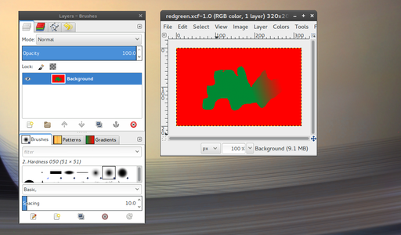
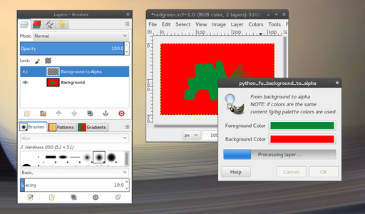
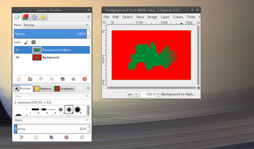
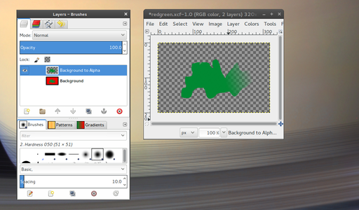

# AlternativeOutput Extra Gimp features

## Plugin - Background to alpha

### Description

Starting from a layer with mainly 2 colors or a combination of them create an alpha channel
using, in the 3D color space, the intersection between the segment from foreground
color to background color points and the perpendicular plane passing to each pixel of
the layer.

### Usage

In a layer with mainly 2 colors or a combination of them

from **"Colors"** menu run **"Background to Alpha ..."** plugin

use color parameters **context menu** to import current foreground or background colors if needed
and run the script

at the end a new layer named "Background to Alpha" will be created with the same subject of the
processed layer but without the background color.

### Requirements

Currently numpy python package is required to compute 3D color space minimum distances.

### Installation

Copy `plug-ins/background_to_alpha.py` to `~/.gimp-2.8/plug-ins/` directory.

### TODO
- remove dependency from numpy python package
- reimplement it using C instead of python